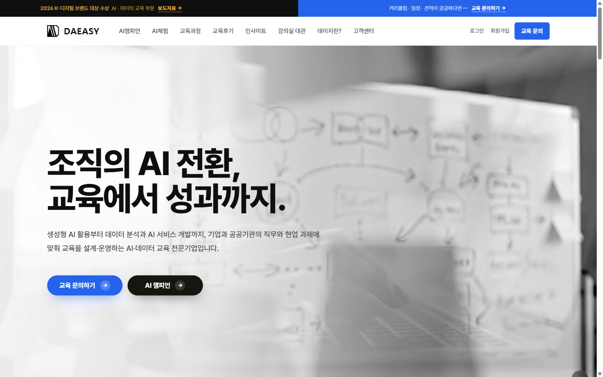
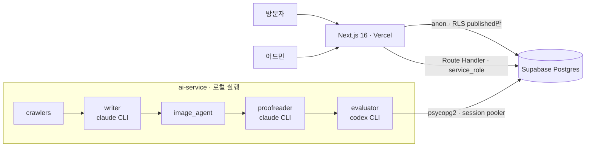

# DAEASY (데이지)

AI·데이터 교육 회사 [daeasy.co.kr](https://daeasy.co.kr) 사이트와, 그 안의 인사이트·교육 사례 코너를 채우는 AI 자동 발행 파이프라인.


[](https://daeasy.co.kr)



## 무엇이 들어 있나

| 영역 | 내용 |
|---|---|
| 공개 사이트 | 교육과정 소개·신청, 교육 사례, AI·데이터 인사이트, AI 체험관, 장비 대여 문의, 고객 가입(Turnstile + 이메일 인증) |
| 어드민 | 교육과정·사례·인사이트 CRUD, 문의 관리, 계정 role(`admin` / `editor`) |
| ai-service/insights | 인사이트 자동 발행: 크롤 → 작성 → 이미지 → 교정 → 평가 → 게시 |
| ai-service/promo | 홍보자료 접수 → 교육 사례 글 작성·평가 → 사이트 발행(네이버는 사람이 최종 발행) |
| AI 체험관 | "내 업무 AI 리포트"·바이브 코딩·레드팀 게임. 런타임 LLM 호출 없이 미리 생성한 응답을 재생 |

## 아키텍처



## 파이프라인에서 결정한 것

- **작성과 평가를 다른 모델이 맡는다.** Writer·Proofreader는 claude, Evaluator는 codex. 한 모델의 취향이 그대로 통과되지 않게 하기 위해서다.
- **합격 판정은 코드가 한다.** LLM은 rubric 7개 항목(사실성·관련성·통찰·출처 연결·SEO·사람 문체·이미지 적합)의 점수 JSON만 낸다. 가중평균 4.0/5.0 미만이면 Writer를 최대 3회 재실행한다. 이미지 항목만 부족하면 image_agent만 다시 돈다.
- **평가 모델은 버전을 고정한다.** CLI 기본값을 따라가다 심사 기준이 말없이 바뀌어 발행이 멈춘 적이 있다.
- **AI 체험관은 런타임 LLM 호출이 없다.** 방문자는 고정 선택지에서 고르고, 미리 생성해 손으로 다듬은 응답을 재생한다. Vercel에 AI 키가 없고 운영비가 0이다.
- **파이프라인은 배포하지 않는다.** 로컬에서 실행해 결과만 Supabase에 적재한다. 발행 산출물과 원본 크롤 데이터는 `data(insights):` 커밋으로 남는다.

## 스택

Next.js 16 · React 19 · TypeScript · Tailwind v4 · Supabase (Postgres · Auth · RLS) · Vercel · Upstash Redis(rate limit) · Cloudflare Turnstile · Python 3.12 + uv · claude / codex CLI

<details>
<summary>구조와 셋업</summary>

### 구조

```
dataeasy/
├── frontend/      Next.js 16 + React 19 + Tailwind v4
│                  └ 공개 사이트 + 어드민 UI + API Route Handler
├── ai-service/    인사이트 자동 발행(insights/) + 홍보발행(promo/) — uv, claude·codex CLI 서브프로세스
├── supabase/      DB 스키마 / 마이그레이션 / RLS
├── scripts/       일회성 유틸 (이미지 정규화 등)
├── .claude/
│   └── commands/  슬래시 명령어 (/insight-publish, /review-publish)
├── docs/
└── CLAUDE.md      이 프로젝트 작업 가이드
```

별도 백엔드 서버는 없다. 트랜잭셔널 API 는 모두 `frontend/src/app/api/*/route.ts` (Next.js Route Handler) 로 처리한다.
옛 FastAPI 코드는 `archive/backend-fastapi` 브랜치에 보관.

### 1. Supabase

`supabase/migrations/` 의 SQL 을 파일명 순서대로 실행 (Studio SQL Editor 또는 CLI).
자세한 내용은 `supabase/README.md`.

### 2. Frontend

```bash
cd frontend
npm install
cp ../.env.example .env.local   # frontend 섹션만 채우기
npm run dev                     # http://localhost:3000
```

일반 고객 회원가입을 사용하려면 다음 보안 설정도 필요하다.

- Cloudflare Turnstile에서 사이트를 만들고 `NEXT_PUBLIC_TURNSTILE_SITE_KEY`, `TURNSTILE_SECRET_KEY` 설정
- 운영 환경에 Upstash `UPSTASH_REDIS_REST_URL`, `UPSTASH_REDIS_REST_TOKEN` 설정
- `NEXT_PUBLIC_SITE_URL=https://daeasy.co.kr` 설정
- Supabase Auth → URL Configuration의 Site URL을 `https://daeasy.co.kr`로 설정
- Supabase Auth → Email Templates → Confirm signup 링크를 다음 형태로 설정

```html
<a href="{{ .SiteURL }}/auth/confirm?token_hash={{ .TokenHash }}&type=email&next=/mypage">
  이메일 인증
</a>
```

운영 환경에서는 CAPTCHA나 rate limiter 설정이 없으면 고객 가입·로그인을 차단한다.

어드민은 `http://localhost:3000/admin` — Supabase Auth 계정(이메일 + 비밀번호)으로 로그인.
첫 관리자 계정은 Studio 에서 만들고 `public.profiles` 에 `role='admin'` 행을 넣는다.
이후 계정은 관리자가 `/admin/members` 에서 발급한다. 역할은 `admin`(전체) / `editor`(교육과정 · 교육후기만).

### 3. AI 서비스 (인사이트 자동 발행)

```bash
cd ai-service
uv sync
cp ../.env.example .env         # ai-service 섹션만 채우기
```

- `claude` CLI (Writer / Proofreader / 이미지 키워드) 와 `codex` CLI (Evaluator) 가 PATH 에 있어야 한다
- `ANTHROPIC_API_KEY` 는 비워둔다 — Anthropic Max 구독을 사용한다
- 배포하지 않는다. 로컬에서 실행해 결과만 Supabase 에 적재한다

### 슬래시 명령어

`.claude/commands/` 안의 명령어는 Claude Code 에서 실행:

- `/insight-publish` — 크롤러 → Writer → Image → Proofreader → Evaluator → DB 업로드
- `/review-publish` — 홍보자료 접수 건을 사이트 발행까지 처리 (`ai-service/promo/run.py`)

### 배포

| 대상 | 위치 |
|---|---|
| 사이트 + API | Vercel (Root Directory = `frontend`) |
| DB / RLS | Supabase Cloud |
| Rate limiter (선택) | Upstash Redis |
| ai-service | 배포 없음 (로컬 실행) |

</details>

## 진행 상태

- [x] 모노레포 골격, DB 스키마 · RLS
- [x] ai-service 인사이트 파이프라인 (크롤 → 작성 → 평가 → DB) E2E
- [x] 공개 페이지 (홈 / 소개 / 교육과정 / 사례 / 인사이트 / 대여 / 지원 / 문의)
- [x] 문의 · 대여 접수 API + rate limit
- [x] 어드민 인증 + 문의 관리
- [x] 어드민 교육과정 · 교육 사례 CRUD
- [x] Vercel 배포
- [x] AI 체험관 (`/quiz`) — 내 업무 AI 리포트 · 바이브 코딩 · 레드팀 게임
- [x] 홍보발행 오케스트레이터 (`ai-service/promo`)
- [ ] 뉴스레터 발송 (구독 접수만 구현됨, 발송 경로 · 메일 서비스 미정)

더 깊은 문서: [`CLAUDE.md`](./CLAUDE.md), [`docs/architecture.md`](./docs/architecture.md), [`supabase/README.md`](./supabase/README.md)
